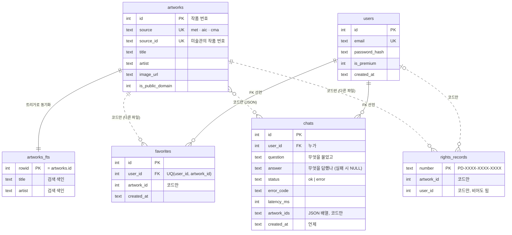

# 저작권 걱정 없는 퍼블릭 도메인 명화 찾기 챗봇 (AITOOLLEARN-7-1)

"상업적으로 써도 되는 명화"를 한국어로 물어보면, MET·Art Institute of Chicago의 **CC0(퍼블릭 도메인) 작품 DB**에서
근거를 찾아 답하고 원본 이미지·출처 링크를 카드로 보여주는 웹 챗봇 (FastAPI).

**서비스 URL: https://art-chatbot-eight.vercel.app**

> **프로젝트 위키**: 기능·구조·결정 이유를 쉬운 말로 정리한 LLM 위키는 [`wiki/index.md`](wiki/index.md).
> 코드가 바뀌면 [`wiki/AGENTS.md`](wiki/AGENTS.md) 규칙대로 위키도 고치고 `python3 scripts/wiki_lint.py`로 점검한다.


[](https://scorecard.dev/viewer/?uri=github.com/KANGSIK-SEO/AITOOLLEARN-7-1)
[](https://github.com/KANGSIK-SEO/AITOOLLEARN-7-1/actions/workflows/codeql.yml)
[](https://developer.mozilla.org/en-US/observatory/analyze?host=art-chatbot-eight.vercel.app)
— 보안 점수·인증 준비: [`docs/security-certification.md`](docs/security-certification.md), 취약점 신고: [`SECURITY.md`](SECURITY.md)

## 1. 프로젝트 개요
- **문제**: PPT·블로그·굿즈·썸네일 제작자는 "저작권 걱정 없는 명화"를 찾을 때 라이선스를 일일이 확인해야 한다.
  범용 챗봇은 라이선스·원본 이미지 링크를 보증하지 못한다.
- **타깃 사용자**: 디자이너, 콘텐츠 제작자, 학생, 미술 입문자
- **핵심 시나리오**: 로그인 → "카페 벽에 걸 세로형 포스터" → 작품 카드(썸네일·작가·연도·CC0·가로/세로형·원본/출처 링크) + 한국어 설명
  → **더 보기**로 같은 조건의 작품을 AI 호출 없이 계속 넘겨 보기 → ☆ 즐겨찾기 · ⬇ 다운로드 · 출처 표기 문구 복사
- **데이터**: [MET Open Access](https://metmuseum.github.io/), [Art Institute of Chicago API](https://api.artic.edu/docs/) (둘 다 CC0, API 키 불필요)

### 권리 데이터 + 판단 규칙 + 권리 근거 기록
이 서비스가 파는 것은 "써도 된다는 보증"이 아니라 **써도 되는지 확인하는 수고를 대신하고, 그 근거를 날짜와 함께 보관해 주는 것**이다. **설계도는 [`docs/rights-policy.md`](docs/rights-policy.md)** — 규칙을 바꾸려면 이 문서부터 고친다.
- **권리 데이터**: 작품마다 기관·기관 작품 ID·작품 단위 근거 필드·라이선스·권리 확인일(`collected_at`, 재수집 시 갱신)
- **판단 규칙** (`app/rights.py`): 허용 기관(MET·AIC·CMA) + R1~R6. 하나라도 실패하면 검색에서 제외, 확인일 365일 초과는 "재확인 필요"
  보류 기관(NGA·Smithsonian·Rijksmuseum·e뮤지엄)은 등록만 돼 있고 환경 변수로도 켤 수 없다.
- **권리 근거 기록** (`POST /api/records` → `/records/{기록 번호}`): 발급 시점 스냅숏을 저장하고, 기관 작품 페이지와
  API 응답을 인터넷 아카이브에 보관해 그 링크를 넣는다. 서명값으로 기록 변조 여부를 표시한다. 인쇄/PDF용 한 장.
- **파일럿**: `ALLOWED_SOURCES=met`이면 MET CC0 작품만 나온다 — 5명에게 "이 기록이 있으면 안심하고 쓰겠냐"를 먼저 묻는다.
- **용도 기준 추천**: "카페 벽에 걸 세로형 포스터"처럼 물으면 AI가 용도·비율(가로/세로/정사각)·분위기를 뽑아 필터와 설명에 반영한다.
  해상도는 아직 작품별 수치가 없어 걸러내지 않고, 원본 링크에서 확인하도록 안내한다.

## 2. 시스템 구조

**한눈에 보기** (팀원 전원 필독 — 본인 담당 파일은 깊게, 나머지는 이 정도만 알면 충분합니다)
- `app/main.py` — **조립.** 앱을 만들고 보안 헤더·요청 감시(request_id·가디언) 미들웨어를 건 뒤 목적별 라우터를 붙인다.
- `app/routers/` — **창구.** 목적별 API: `auth`(가입·로그인) · `chat`(챗봇) · `logs`(내 대화 로그) · `favorites` · `artworks`(더 보기·이미지) · `records`(권리 근거 기록) · `explain` · `health` · `ops`(운영 점검) · `pages`(화면).
- `app/deps.py` — **출입증 검사.** 로그인 필수/선택, 크론 전용 검사를 FastAPI `Depends`로 재사용한다.
- `app/schemas.py` — **양식.** 요청/응답 모양(Pydantic). `app/errors.py` — 모든 오류를 `{"error": {"code", "message"}}` 한 모양으로.
- `app/repository.py` — **창고 관리.** users·chats·favorites SQL을 모아 라우터에서 SQL을 뺐다.
- `app/auth.py` — **문지기.** 비밀번호 해시(scrypt)와 로그인 쿠키(HMAC 서명) 검증. 초대코드(프리미엄) 여부도 이 쿠키에 담긴다. 서버에 세션을 저장하지 않음.
- `app/chat.py` — **지휘자.** "질문 → 검색조건 추출 → 검색 → 답변 생성" 파이프라인을 순서대로 지휘.
- `app/art.py` — **검색엔진.** `data/art.db`에서 SQLite FTS5로 작품을 찾음. AI 호출 없이 순수 DB 검색. 상위 2개(`GUARANTEED_TOP`)는 관련도순 고정, 나머지는 후보 풀에서 무작위로 섞어 같은 질문이라도 항상 똑같은 작품만 나오지 않게 한다.
- `app/llm.py` — **AI 통신창구.** `ANTHROPIC_API_KEY`가 있으면 Claude(`app/claude_llm.py`, 기본 `claude-haiku-5-5` — 가장 저렴하고 빠른 Claude)를 먼저 쓰고, 실패하면 OpenAI `gpt-6-astra` → Upstage `solar-pro4` 순서로 넘어간다. 답변을 조각조각 받는 스트리밍(`stream_completion`)도 여기서 고른다. 타임아웃·에러를 통일된 형태로 반환.
- `app/db.py` — **저장소.** 사용자·대화 로그·가디언 사건 저장(로컬 SQLite 또는 Turso 자동 선택).
- `app/config.py` — **규칙집.** 사용 모델(gpt-6-astra/폴백 solar-pro4)·초대코드·요금제 상한 등 설정을 고정.
- `app/guardian.py` — **가디언.** 장애·보안 사건을 즉시 기록·대응(잠금, AI 백오프, 악성 입력 차단)하고, 1일 1회 gpt-6-astra로 일괄 분석·GitHub 이슈까지 생성.
- `app/static/*` — **화면.** 브라우저에 보이는 HTML/JS/CSS 전부(프레임워크 없음). 갤러리 톤 디자인, 한/영 전환, 라이트/다크 테마, 왼쪽 대화 기록 사이드바. 구조는 [`wiki/frontend.md`](wiki/frontend.md).

```
브라우저 ─ /static (HTML/JS) ─┐
                              ├─ FastAPI (app/main.py, Vercel Function) — 미들웨어: request_id·가디언 감시·보안 헤더
  POST /api/chat ─────────────┘    ├─ 라우터 app/routers/chat.py ← Depends(current_session) (app/deps.py, 비로그인 401)
                                   ├─ 인증: scrypt 해시 + HMAC 서명 쿠키 (app/auth.py, is_premium 포함)
                                   ├─ chat.extract_intent → gpt-6-astra (검색 조건 JSON)
                                   ├─ art.search → data/art.db (읽기 전용 SQLite + FTS5)
                                   ├─ chat.compose_answer → gpt-6-astra (근거 기반 한국어 답변)
                                   ├─ guardian: 실패 시 즉시 기록·대응 (잠금/백오프/차단)
                                   └─ repository.save_chat → db.execute → Turso(SQLite 호환): users, chats, incidents
```

```
app/
├─ main.py            앱 조립 (미들웨어·오류 처리기·라우터 연결)
├─ routers/           API 계층 — 요청을 받고 검증해 서비스·리포지토리를 부른다
│  ├─ auth.py         POST /api/auth/signup·login·logout, GET /api/me
│  ├─ chat.py         POST /api/chat, /api/chat/stream
│  ├─ logs.py         GET /api/me/chats
│  ├─ favorites.py    POST·DELETE /api/favorites, GET /api/me/favorites
│  ├─ artworks.py     GET /api/artworks, /api/img/aic/{id}
│  ├─ records.py      /api/records…, /records/{number}
│  ├─ explain.py      /api/explain, /explain/{token}
│  ├─ health.py       /api/health, /healthz
│  ├─ ops.py          /api/guardian/* (CRON_SECRET)
│  └─ pages.py        /, /sw.js (캐시 무효화)
├─ deps.py            인증 의존성 (current_session·current_user·optional_session·require_cron)
├─ schemas.py         요청/응답 스키마
├─ errors.py          공통 오류 응답·예외 처리기
├─ repository.py      사용자 DB 접근 (users·chats·favorites)
├─ db.py              DB 접속 (Turso/로컬 SQLite, 타임아웃)
└─ chat.py · art.py · llm.py · claude_llm.py · guardian.py · records.py · rights.py   서비스 계층
```
| 컴포넌트 | 역할 |
|---|---|
| `app/main.py` | 앱 조립: 미들웨어(request_id·가디언·보안 헤더), 라우터 연결 |
| `app/routers/*` | 목적별 API (auth·chat·logs·favorites·artworks·records·explain·health·ops·pages), 입력 검증 |
| `app/deps.py` | 인증 의존성 — 로그인 필수/선택, 크론 전용 |
| `app/schemas.py` · `app/errors.py` | 요청/응답 스키마, 공통 오류 응답 |
| `app/repository.py` | users·chats·favorites SQL (라우터와 DB 분리) |
| `app/chat.py` | 질문 → 검색 의도 → DB 검색 → 답변 생성 파이프라인 |
| `app/llm.py` | OpenAI gpt-6-astra 호출(서버 전용, 타임아웃 설정) + solar-pro4 비상 폴백 |
| `app/config.py` | 사용 모델(gpt-6-astra)·키 이름·초대코드/요금제 상한 등 설정 |
| `app/guardian.py` | **가디언** — 장애·보안 사건 즉시 대응 + 1일 1회 AI 일괄 분석 (`/api/guardian/daily-digest`) |
| `app/db.py` | 사용자·로그·사건 DB (Turso 또는 로컬 SQLite 자동 선택) |
| `scripts/collect_*.py` | 공개 API → `data/art.db` 수집기 |

문맥 유지: 같은 사용자의 최근 `CONTEXT_TURNS`(5)개 Q/A를 답변 프롬프트에 포함한다.

### 2.1 온디바이스 추천 (Datalog, 서버/AI 호출 없음)
채팅창 안 "🧠 온디바이스 추천" 패널은 서버나 gpt-6-astra를 전혀 거치지 않고, **브라우저 안에서만** 작품을 고른다.
- `scripts/export_artworks_json.py`가 `data/art.db`(CC0만, `is_public_domain = 1`)를 `app/static/artworks.json`으로 내보낸다. `data/art.db`가 바뀔 때만 다시 실행하면 된다.
- `app/static/ondevice.js`가 이 JSON을 최초 1회만 받아 메모리에 캐시하고, 사용자가 고른 화풍/주제/연도 조건을 **Datalog 스타일 규칙**으로 조합해 그 자리에서 배열 필터링한다 (예: `candidate(W) :- style(W, "Impressionism"), subject(W, "landscape").`). 주제어가 여러 개면 "같은 head를 가진 규칙이 여러 개면 합집합"이라는 실제 Datalog 의미론대로 규칙을 여러 줄로 나눠 OR로 평가한다. 재귀가 필요 없는 질의라 naive bottom-up 평가로 충분하다.
- **"AI 없이 이해하기"**: 자유 문장(예: "봄 느낌 풍경화")을 입력하면, LLM 없이 **한/영 키워드 사전 매칭**만으로 화풍/주제/연도를 추출해 위 규칙에 자동으로 채운다 — gpt-6-astra가 하는 자연어 이해를 훨씬 단순한 규칙 기반으로 대체한 버전. 사전에 없는 단어는 당연히 못 알아듣는다(의도된 한계이자 AI와의 핵심 차이점).
- 카드 렌더링은 채팅과 동일한 `buildResultGroup()`·`makeCard()`를 그대로 재사용 — 결과 화면이 100% 같은 스타일.
- Oxford Semantic Technologies(RDFox)가 갤럭시 기기에 Datalog 추론 엔진을 온디바이스로 넣은 것과 같은 설계 철학: 클라우드로 보내지 않고 기기에서 바로 추론한다.

## 3. API 명세
오류는 항상 `{"error": {"code": "...", "message": "..."}}` (`app/errors.py`).
서버를 켜고 `http://localhost:8000/docs`를 열면 요청/응답 스키마(`app/schemas.py`)가 담긴 자동 API 문서를 볼 수 있다.
경로는 자원 이름(명사) + 메서드로 정했다: 만들기 `POST`, 조회 `GET`, 지우기 `DELETE`, 내 자원은 `/api/me/...`.
인증: 웹은 로그인 시 발급되는 `session` 쿠키(HttpOnly)로, TV 앱 등 다른 오리진 클라이언트는 응답의 `token`을
`Authorization: Bearer <token>` 헤더로 보낸다. 둘 다 있으면 쿠키가 우선한다. 토큰 유효기간은 7일.

| 메서드 | 경로 | 설명 |
|---|---|---|
| POST | `/api/auth/signup` | `{email, password(8~128자), private_code?}` → 201, `{user, token}` + 세션 쿠키 (`private_code`가 `PREMIUM_CODE`와 일치하면 프리미엄 가입) |
| POST | `/api/auth/login` | `{email, password}` → 200, `{user, token}` + 세션 쿠키 |
| POST | `/api/auth/logout` | 쿠키 삭제 → `{"ok": true}` |
| GET | `/api/me` | **로그인 필요**. 현재 사용자 |
| POST | `/api/chat` | **로그인 필요**. 질문 → 답변(한국어+영어) + 작품 카드 + 남은 무료 횟수 |
| POST | `/api/chat/stream` | **로그인 필요**. 같은 일을 한 줄씩(NDJSON) 보낸다: `meta`(작품 카드·검색 조건, 검색이 끝나자마자) → `delta`(답변 글 조각) → `done`(저장 결과) 또는 `error`. 웹 화면은 이걸 쓰고, 안 되면 `/api/chat`으로 다시 시도 |
| GET | `/api/me/chats?limit=20&offset=0` | **로그인 필요**. 내 대화 로그 (최신순, `limit` 1~100) |
| POST | `/api/favorites` | **로그인 필요**. `{artwork_id}` 작품 즐겨찾기 저장 (상세: `docs/track-c.md`) |
| DELETE | `/api/favorites/{artwork_id}` | **로그인 필요**. 즐겨찾기 해제 |
| GET | `/api/me/favorites?limit=20&offset=0` | 내 즐겨찾기 작품 카드 조회 |
| GET | `/api/health` | 프로세스 생존 확인 (항상 200) |
| GET | `/healthz` | 의존성 상태 확인: 사용자 DB·미술 DB에 실제 쿼리 → 모두 정상 200, 하나라도 실패 503 (`{"status": "ok|degraded", "checks": {...}}`) |
| GET | `/api/artworks?q=a,b&artist=&year_from=&year_to=&offset=0&limit=24` | **더 보기** — AI 없이 DB만 관련도순 페이지 조회 (`{artworks, has_more}`, IP당 시간당 600회) |
| POST | `/api/records` | 권리 근거 기록 발급 `{artwork_id}` → `{number, url, archived}` (판단 규칙 미통과 409 `RECORD_NOT_ALLOWED`, IP당 시간당 60회) |
| GET | `/records/{number}` | 저장된 권리 근거 기록 (HTML, 인쇄/PDF 저장용) |
| POST | `/api/records/{number}/archive` | 인터넷 아카이브 보관 다시 시도 |
| GET | `/api/img/aic/{image_id}?w=1686&download=1` | AIC 이미지 프록시 (`download=1`이면 파일로 저장) |
| GET | `/api/guardian/daily-digest` | 가디언 일일 점검 (`CRON_SECRET` 필요, Vercel Cron 전용) |
| POST | `/api/explain` | 피어 리뷰용 설명 에이전트. `{question, secret}` → `{"answer": "..."}` (`EXPLAIN_AGENT_SECRET` 미설정 시 항상 401) |
| GET | `/explain/{token}` | 설명 에이전트 화면 (토큰이 틀리거나 비활성이면 404) |

아래 예시는 로컬 서버에 실제로 요청해 받은 응답의 형태 그대로다 (`token`은 줄였고, AI 답변 문장과 `latency_ms`는 예시 값).

`POST /api/auth/signup` · `POST /api/auth/login`
```json
// 요청
{"email": "a@b.com", "password": "password123"}
// 응답 201(가입) / 200(로그인) — Set-Cookie: session=...
{"user": {"id": 1, "email": "a@b.com", "is_premium": false}, "token": "eyJ1aWQiOiAx..."}
```

`GET /api/me`
```json
{"user": {"id": 1, "email": "a@b.com", "created_at": "2026-10-06T13:50:08+00:00", "is_premium": false}}
```

`POST /api/chat`
```json
// 요청
{"message": "봄 느낌 풍경화 3개 찾아줘"}
// 응답 200 (artworks는 1개만 표시)
{"chat_id": 1, "saved": true, "request_id": "d20def8c",
 "reply": "[1] Spring in Brittany — ...\n\nEnglish: [1] Spring in Brittany — ...",
 "artworks": [{"id": 4613, "source": "met", "title": "Spring in Brittany", "artist": "Paul Sébillot",
               "date_display": "1874", "medium": "Oil on wood",
               "image_url": "https://images.metmuseum.org/CRDImages/ep/original/DP-17429-001.jpg",
               "thumbnail_url": "https://images.metmuseum.org/CRDImages/ep/web-large/DP-17429-001.jpg",
               "source_url": "https://metmuseum.org/art/collection/search/437647", "license": "CC0",
               "credit_line": "Gift of Paul-Yves Sébillot, 1949", "is_highlight": 0}],
 "remaining_free": 99, "show_limit_warning": false}
// saved: 대화 로그 저장 성공 여부 (DB 저장에 실패해도 답변은 200으로 준다 → chat_id null, saved false)
// remaining_free: 이번 질문을 포함해 남은 평생 무료 질문 수. 초대코드(프리미엄) 사용자는 상한이 없어 항상 null.
// show_limit_warning: 남은 무료 질문이 FREE_LIMIT_WARNING_THRESHOLD(기본 10) 이하일 때만 true.
// AIC 작품의 image_url·thumbnail_url은 서버 프록시 주소(/api/img/aic/<id>?w=1686|400)로 바뀌어 나온다.
// 오류 예
{"error": {"code": "AI_TIMEOUT", "message": "응답이 지연되고 있어요. 잠시 후 다시 시도해 주세요."}}
```

`GET /api/me/chats?limit=1`
```json
{"chats": [{"id": 1, "question": "봄 느낌 풍경화 3개 찾아줘", "answer": "[1] Spring in Brittany — ...",
            "status": "ok", "error_code": null, "latency_ms": 2310, "created_at": "2026-10-06T13:50:08+00:00"}]}
// 실패한 질문은 status "error", answer null, error_code "AI_TIMEOUT" 등으로 남는다.
```

오류 코드:
- 공통: `UNAUTHENTICATED`(401) `INVALID_INPUT`(422 요청 형식 오류 / 400 의심스러운 입력 차단) `DB_ERROR`(503)
  `INTERNAL_ERROR`(500, 예상 못한 예외는 모두 여기로 모이고 가디언이 기록한다)
- 가입·로그인: `INVALID_EMAIL`/`INVALID_PASSWORD`(400) `EMAIL_TAKEN`(409) `INVALID_CREDENTIALS`(401)
  `RATE_LIMITED`(429, 같은 IP의 가입 시간당 10회·로그인 10분당 20회 초과 또는 같은 이메일 로그인 5회 실패 후 15분 잠금)
- 챗봇: `EMPTY_MESSAGE`/`MESSAGE_TOO_LONG`(400) `RATE_LIMITED`(429, 시간당 일반 30회·초대코드 300회)
  `FREE_LIMIT_REACHED`(403, 초대코드 없는 계정의 평생 무료 질문 100회 소진)
  `AI_TIMEOUT`(504) `AI_ERROR`(502) `AI_RATE_LIMITED`(429) `AI_BACKED_OFF`/`AI_KEY_MISSING`(503) `ART_DB_ERROR`(503)
- 더 보기·근거 기록: `ARTWORK_NOT_FOUND`(404) `RECORD_NOT_ALLOWED`(409, 판단 규칙 미통과) `RECORD_NOT_FOUND`(404)

**초대코드(프리미엄)**: 회원가입 시 `private_code`로 `PREMIUM_CODE`(서버 환경변수)와 일치하는 값을 보내면 해당 계정은
- 시간당 질문 한도가 `CHAT_LIMIT_PER_HOUR_PREMIUM`(기본 300)으로 상향되고, **평생 무료 질문 100회 제한이 적용되지 않는다**
  (일반 계정은 `CHAT_LIFETIME_LIMIT_FREE`(기본 100)회를 다 쓰면 `FREE_LIMIT_REACHED`로 막힌다).
- 추천 작품 수가 `ART_RESULTS_LIMIT_PREMIUM`(기본 100, 일반은 `ART_RESULTS_LIMIT`=6)으로 늘어난다. 답변 본문에서 번호로
  설명하는 작품은 `ANSWER_NARRATION_LIMIT`(6)개까지만이고 — 100개를 전부 LLM이 한 줄씩 설명하면 토큰 비용이 커지고
  응답이 잘릴 수 있어서다 — 나머지는 카드로만 보여주고 "그 외 N개를 더 찾았어요"를 한 줄 덧붙인다(`app/chat.py`).
- 상단 바 이메일 옆에 "초대 회원" 배지가 붙는다(`app/static/index.html`의 `#premium-badge`, `app/static/app.js`의 `show()`).

초대코드 여부는 서버 세션 없이 서명된 쿠키에 담기므로(`app/auth.py`) 가입/로그인 시점 기준이며, 코드 입력 UI는
로그인 화면이 아니라 **회원가입** 화면에만 있다(`app/static/index.html`).

## 4. DB 구조


실선은 DB에 외래 키(FK)로 선언된 관계, 점선은 작품 DB가 다른 파일(`data/art.db`)이라 코드에서만 잇는 관계다.

- `data/art.db` (읽기 전용, 레포에 포함): `artworks`(source, source_id, title, artist, date_display, medium, subjects, image_url, source_url, license, is_public_domain …) + `artworks_fts`(FTS5). 스키마: `db/schema.sql`
- Turso/SQLite (쓰기): 
  - `users(id, email UNIQUE, password_hash, is_premium, created_at)`
  - `chats(id, user_id → users.id, question, answer, status[ok|error], error_code, latency_ms, artwork_ids(JSON), created_at)`
  - `favorites(id, user_id → users.id, artwork_id(art.db artworks.id), created_at, UNIQUE(user_id, artwork_id))` — 즐겨찾기
  - `incidents(id, category[reliability|security], code, message, context(JSON), severity, auto_action, diagnosis, created_at)` — 가디언 사건 로그. `diagnosis`는 일일 배치 분석 전까지 NULL.
  - `rights_records(number PK, artwork_id, user_id, snapshot(JSON), archives(JSON), signature, issued_at)` — 권리 근거 기록 (발급 시점 그대로)
  - `runtime_flags(key, value, updated_at)` — AI 백오프·로그인 잠금 등 자동 대응 상태값 (예: `ai_backoff_until`, `lockout:<email>`)
  - `rate_counters(bucket, count, window_start)` — IP/이메일 단위 레이트리밋 카운터

**작품 DB 확장**: `scripts/collect_met.py`는 기본으로 6개 부서(유럽 회화·미국관·아시아·드로잉/판화·리먼·사진),
`scripts/collect_aic.py`·`scripts/collect_cma.py`(클리블랜드, `share_license_status=CC0`만)는 회화·판화·드로잉·사진을 수집한다(AIC 1000건 제한은 연도 구간을 자동으로 반씩 쪼개 회피).
기존 DB에 이어서 저장되므로 그냥 다시 실행하면 된다 (MET는 1건당 0.5초 쉬어 가서 전체 수집에 몇 시간 걸림).
```bash
cd scripts && python3 collect_aic.py && python3 collect_met.py
```

**가로형/세로형 판별**: 카드 이미지가 로드되면 브라우저가 실제 비율로 가로형(≥1.15)/세로형(≤0.87)을 판별하고,
결과 묶음의 비율 필터(전체/가로형/세로형)로 거른다. "PPT·배너·배경화면"이 들어간 질문은 AI가
`orientation: landscape`를 뽑아 가로형 필터가 자동으로 켜진다.

**대화 로그를 왜 저장하는가**
- **사용자**: 지난 질문·답변을 다시 본다 (왼쪽 대화 기록 사이드바 ← `GET /api/me/chats`), 최근 5개는 다음 답변의 문맥이 된다.
- **운영(추적)**: 실패한 질문도 `status='error'`, `error_code`(예: `AI_TIMEOUT`), `latency_ms`로 남는다. 서버 로그의 같은 `request_id`로 "요청 → AI 호출 → DB 저장" 중 어디서 끊겼는지 찾는다.
- **비용 보호**: 사용자별 시간당·평생 질문 수를 `chats`에서 세어 한도를 건다 (`app/routers/chat.py`).
- **개선**: 쌓인 질문으로 검색 조건 추출·답변 품질을 평가한다 (`scripts/eval_llm.py`, `docs/llm-eval.md`).

**DB 확인 가이드** (택 1 이상)
1. 로그 조회 API: `curl -b cookies.txt https://<서비스>/api/me/chats`
2. 확인용 SQL: `scripts/check_logs.sql` (`turso db shell <db-name> < scripts/check_logs.sql`)
   - 로컬 실행(Turso 값 없음)이면 DB 파일은 `data/app.db`: `sqlite3 data/app.db < scripts/check_logs.sql`
     (sqlite3가 없으면 `python -c "import sqlite3; print(sqlite3.connect('data/app.db').execute('SELECT user_id, created_at, question, status FROM chats ORDER BY id DESC LIMIT 10').fetchall())"`)
3. 서버 로그: `request_received`, `ai_call_start`, `ai_call_success|ai_call_failure`, `db_save_success|db_save_failure` 이벤트를 stdout(Vercel Logs)에 남긴다. 모든 줄 끝에 `request_id`가 붙는다. 한 요청 안의 단계별 소요시간은 `chat_stage stage=intent|search|answer request_id=… latency_ms=… ok=…`로 따로 남는다(`app/chat.py`). 전체 이벤트 목록: [`docs/logging.md`](docs/logging.md)

## 5. 실행·배포
```bash
python3 -m venv .venv && .venv/bin/pip install -r requirements-dev.txt
cp .env.example .env         # 값 채우기
.venv/bin/uvicorn app.main:app --reload    # http://localhost:8000
.venv/bin/python -m pytest -q tests
```
**Linux(Ubuntu 24.04) 환경에서 실행·검증**

개발은 macOS에서 했고, 배포 전에 Ubuntu 24.04 컨테이너에서 동일 코드를 설치·테스트·실행해 검증했다.
```bash
docker build -t art-chatbot-ubuntu .
docker run --rm art-chatbot-ubuntu python -m pytest -q tests          # Ubuntu 24.04, Python 3.12
docker run -d --rm -p 8000:8000 --env-file .env art-chatbot-ubuntu    # http://localhost:8000
```
Vercel Functions도 Linux 런타임에서 실행되며, 배포는 Ubuntu 24.04 컨테이너(`deploy/Dockerfile`, Node + Vercel CLI)의 셸에서 실행했다.
```bash
docker build -t art-vercel-ubuntu deploy
docker run --rm -it -v vercel-auth:/root/.local/share -v vercel-auth-cfg:/root/.config -v "$PWD":/app art-vercel-ubuntu vercel login
docker run --rm -v vercel-auth:/root/.local/share -v vercel-auth-cfg:/root/.config -v "$PWD":/app art-vercel-ubuntu vercel deploy --prod --yes
```
서버 없이 Ubuntu 서버에 직접 올리는 경우에는 `apt install python3-venv` 후 위 "실행" 절차와 `uvicorn`을 systemd로 상시 실행하면 된다.

**환경 변수** (`.env.example` 참고, 값은 절대 커밋하지 않는다)

| 이름 | 설명 |
|---|---|
| `ANTHROPIC_API_KEY` (선택) | Claude API 키. **있으면 Claude가 주 모델**이 되고, 크레딧 소진·한도·인증 문제로 실패하면 Upstage solar-pro4가 이어받는다(solar 키가 없으면 GPT) (`app/claude_llm.py`) |
| `CLAUDE_MODEL`, `CLAUDE_INTENT_MODEL`, `CLAUDE_EFFORT` (선택) | 답변·가디언 모델(기본 `claude-haiku-5-5`), 검색 조건 뽑기 모델(기본 같은 모델), 생각 깊이(기본 `low`, Haiku에는 보내지 않음). Fable(`claude-fable-5-1`)은 자동 코드 수정에만 쓴다 |
| `GPT_ASTRA_API_KEY` | OpenAI gpt-6-astra 키 (Claude 키가 없을 때 주 모델, 있을 때는 대체 모델) |
| `UPSTAGE_API_KEY` (선택) | Upstage solar-pro4 키. Claude나 GPT가 소진·한도·인증 문제로 실패할 때 이어받는 비상용 |
| `SECRET_KEY` | 세션 서명 키 (32자 이상 랜덤) |
| `TURSO_DATABASE_URL`, `TURSO_AUTH_TOKEN` | Turso DB. **없으면 로컬 `data/app.db` 사용** |
| `TIMEOUT_SECONDS` | **모든 타임아웃(기본 25초)** — 요청 하나도 25초 안에 끝내고, 넘으면 "죄송합니다. 접속자가 많습니다." (AI·Turso·이미지·아카이브·GitHub 공통. `LLM_TIMEOUT_SECONDS`, `LLM_CALL_BUDGET_SECONDS`로 AI만 따로 줄일 수 있음) |
| `LLM_REASONING_EFFORT` | gpt-6-astra reasoning_effort (기본 low — 비용 보호) |
| `CRON_SECRET` | 가디언 일일 점검(`/api/guardian/daily-digest`)을 Vercel Cron만 호출하게 막는 값 |
| `GITHUB_TOKEN` (선택) | 긴급도 medium/high 사건 발생 시 GitHub 이슈 자동 생성 (issues:write) |
| `GITHUB_REPO` (선택) | 이슈를 열 저장소, 기본 `KANGSIK-SEO/AITOOLLEARN-7-1` |
| `PREMIUM_CODE` (선택) | 회원가입 시 입력받는 초대코드 (비우면 초대코드 가입 비활성) |
| `CHAT_LIMIT_PER_HOUR_PREMIUM` | 초대코드 사용자 시간당 질문 상한(기본 300) |
| `CHAT_LIFETIME_LIMIT_FREE` | 초대코드 없는 사용자의 평생 무료 질문 수(기본 100) |
| `ART_RESULTS_LIMIT_PREMIUM` | 초대코드 사용자에게 보여줄 추천 작품 수(기본 100) |

**LLM 답변 품질**: 개선한 방법과 측정 방법은 [`docs/llm-eval.md`](docs/llm-eval.md).
`python3 scripts/eval_llm.py`로 질문 20개 평가 세트를 돌려 의도 추출 정확도·근거성(환각)·규칙 준수율을 잰다.

**캐시 무효화**: 서버가 화면 파일 내용으로 버전을 만들어 `index.html`의 정적 파일 주소(`?v=버전`)와
서비스워커 캐시 이름에 붙인다. 배포로 파일이 바뀌면 버전이 바뀌어 옛 캐시를 자동으로 버린다 (`app/routers/pages.py`).

**자동 배포 (GitHub Actions)**
- `.github/workflows/deploy.yml`: **`main`에 PR이 합쳐질 때마다** Vercel 프로덕션 배포를 한다. 배포된 코드 = `main` (feature → `develop` → `main`).
- `.github/workflows/collect-and-deploy.yml`: Actions 탭에서 **손으로 실행**하면 미술관 작품을 수집해 `data/art.db`를 커밋한다 (MET는 1건당 0.5초라 최대 약 4시간).
- `.github/workflows/llm-eval.yml`: 프롬프트 코드가 `main`에 합쳐지면 LLM 평가(`scripts/eval_llm.py`)를 돌려 결과를 Actions 요약에 남긴다 (시크릿 `GPT_ASTRA_API_KEY` 필요).
- 필요한 값 (Settings → Secrets and variables → Actions → **Repository secrets**):
  `VERCEL_TOKEN`(Vercel 토큰, scope는 art-chatbot 프로젝트), `VERCEL_SCOPE`(Vercel 팀 이름 `customer-auto`).
  Environment secrets에 넣으면 워크플로가 읽지 못한다. 저장한 값은 다시 보이지 않는 게 정상이다.

**Vercel + Turso 배포 (수동)**
```bash
turso db create art-chatbot && turso db show art-chatbot --url && turso db tokens create art-chatbot
vercel link && vercel env add GPT_ASTRA_API_KEY && vercel env add SECRET_KEY \
  && vercel env add TURSO_DATABASE_URL && vercel env add TURSO_AUTH_TOKEN \
  && vercel env add CRON_SECRET && vercel env add GITHUB_TOKEN
vercel deploy --prod
```
**가디언 (장애 대응 + 보안)**: `app/guardian.py`. 로그인 폭주·AI 429 반복·악성 입력 패턴은
요청마다 비용 없이 즉시 차단/잠금(`incidents`, `runtime_flags` 테이블). 쌓인 사건은 Vercel Cron이
하루 한 번(Hobby 플랜 제한) `/api/guardian/daily-digest`를 호출해 gpt-6-astra로 한 번에 분석하고,
긴급도가 medium/high면 GitHub 이슈를 자동으로 연다. 로컬에서 수동 실행:
```bash
curl -H "Authorization: Bearer $CRON_SECRET" http://localhost:8000/api/guardian/daily-digest
```

## 6. 협업 규칙
브랜치: `main` / `develop` / `feature/*`, 모든 병합은 PR. 팀원별 유의미한 커밋 10회 이상.

## 7. 팀 구성원 역할 및 개인별 작업 요약
| 이름 | 역할 | 담당 이슈 | 작업 요약 |
|---|---|---|---|
| 서강식 | AI/데이터 엔지니어 & 팀 리드 | [#8](https://github.com/KANGSIK-SEO/AITOOLLEARN-7-1/issues/8), [#9](https://github.com/KANGSIK-SEO/AITOOLLEARN-7-1/issues/9), [#10](https://github.com/KANGSIK-SEO/AITOOLLEARN-7-1/issues/10), [#17](https://github.com/KANGSIK-SEO/AITOOLLEARN-7-1/issues/17) | MVP 설계·구현, 검색·AI 파이프라인 고도화, 배포·통합·PR 머지 총괄 (작업 완료 후 PR 번호로 갱신) |
| 유영민 | 프론트엔드 개발자 | [#11](https://github.com/KANGSIK-SEO/AITOOLLEARN-7-1/issues/11), [#12](https://github.com/KANGSIK-SEO/AITOOLLEARN-7-1/issues/12), [#13](https://github.com/KANGSIK-SEO/AITOOLLEARN-7-1/issues/13) | 채팅 UI 스크린리더 접근성([#31](https://github.com/KANGSIK-SEO/AITOOLLEARN-7-1/pull/31)), 시스템 다크/라이트 테마 지원([#32](https://github.com/KANGSIK-SEO/AITOOLLEARN-7-1/pull/32)), AI 응답 대기 인디케이터([#33](https://github.com/KANGSIK-SEO/AITOOLLEARN-7-1/pull/33)), 모바일 작은 화면 레이아웃 개선([#34](https://github.com/KANGSIK-SEO/AITOOLLEARN-7-1/pull/34)), 온디바이스 패널 전환 애니메이션([#35](https://github.com/KANGSIK-SEO/AITOOLLEARN-7-1/pull/35)), PWA 오프라인 캐싱 전략 개선([#36](https://github.com/KANGSIK-SEO/AITOOLLEARN-7-1/pull/36)), 설명 페이지 공통 스타일 적용([#37](https://github.com/KANGSIK-SEO/AITOOLLEARN-7-1/pull/37)), 채팅 메시지 타임스탬프([#38](https://github.com/KANGSIK-SEO/AITOOLLEARN-7-1/pull/38)), 상태 메시지 공통 컴포넌트화([#39](https://github.com/KANGSIK-SEO/AITOOLLEARN-7-1/pull/39)), SEO·공유 미리보기 메타데이터([#40](https://github.com/KANGSIK-SEO/AITOOLLEARN-7-1/pull/40)) |
| 오철호 | 백엔드 개발자 | [#14](https://github.com/KANGSIK-SEO/AITOOLLEARN-7-1/issues/14), [#15](https://github.com/KANGSIK-SEO/AITOOLLEARN-7-1/issues/15), [#16](https://github.com/KANGSIK-SEO/AITOOLLEARN-7-1/issues/16) | 즐겨찾기 API([#19](https://github.com/KANGSIK-SEO/AITOOLLEARN-7-1/pull/19)), 환경변수 검증([#21](https://github.com/KANGSIK-SEO/AITOOLLEARN-7-1/pull/21)), DB 슬로우쿼리 로깅([#22](https://github.com/KANGSIK-SEO/AITOOLLEARN-7-1/pull/22)), LLM 재시도·타임아웃([#23](https://github.com/KANGSIK-SEO/AITOOLLEARN-7-1/pull/23)), FTS5 입력 예외처리([#26](https://github.com/KANGSIK-SEO/AITOOLLEARN-7-1/pull/26)), 단계별 요청 레이턴시 로깅([#27](https://github.com/KANGSIK-SEO/AITOOLLEARN-7-1/pull/27)), `/healthz` 의존성 상태 점검([#28](https://github.com/KANGSIK-SEO/AITOOLLEARN-7-1/pull/28)), 설명 에이전트 에러 메시지 개선([#29](https://github.com/KANGSIK-SEO/AITOOLLEARN-7-1/pull/29)), 가디언·무료한도 단위 테스트 보강([#20](https://github.com/KANGSIK-SEO/AITOOLLEARN-7-1/pull/20), [#24](https://github.com/KANGSIK-SEO/AITOOLLEARN-7-1/pull/24), [#25](https://github.com/KANGSIK-SEO/AITOOLLEARN-7-1/pull/25)), README API 문서 최신화([#30](https://github.com/KANGSIK-SEO/AITOOLLEARN-7-1/pull/30)) |

**GitHub 계정 ↔ 팀원**: 서강식 = `KANGSIK-SEO`, 오철호 = `chul5`, 유영민 = `maebsy`

**AI 도구 사용**: Claude Code(커밋 작성자 `Claude`)를 함께 사용했다. 서강식의 지시·검토 아래
develop 병합·충돌 해결(PR #51), 권리 판단 규칙·권리 근거 기록(`app/rights.py`, `app/records.py`, `docs/rights-policy.md`),
작품 수집 확장(클리블랜드 미술관, GitHub Actions 수집), 용도 기준 추천, 캐시 무효화, LLM 평가(`scripts/eval_llm.py`),
GitHub Actions 배포를 구현했다. FastAPI 계층 분리(`app/routers/`, `app/deps.py`, `app/schemas.py`, `app/errors.py`,
`app/repository.py`로 `app/main.py`를 나눔, 동작 변경 없음)도 같은 방식으로 했다. 모든 변경은 PR로 리뷰 후 병합한다.

## 8. 민감정보 관리
- 모든 키는 환경 변수로만 사용하고 `.env`는 `.gitignore`로 제외한다. 예시는 `.env.example`.
- AI 호출은 서버에서만 수행되며 키는 응답·로그에 노출되지 않는다.
- **모델**: 주 모델은 `gpt-6-astra` (`app/config.py`, `app/llm.py`). GPT 쪽이 429/401/403으로
  실패할 때만 Upstage `solar-pro4`로 한 번 더 시도한다(`UPSTAGE_API_KEY` 설정 시에만 활성, 없으면
  폴백 없이 원래 에러 반환). gpt-6-astra는 실제 과금, solar-pro4는 2026-10 기준 무료·무제한이지만
  **2027-04-01부터 Upstage가 전 모델을 과금 전환**하면서 이 폴백도 끝난다. 호출 비용 보호를 위해
  시간당 질문 상한(`CHAT_LIMIT_PER_HOUR`/`CHAT_LIMIT_PER_HOUR_PREMIUM`), 429 반복 시 자동 백오프,
  요청당 GPT 호출 금지(배치 분석만)로 방어한다.

## 9. 가디언
`app/guardian.py`가 **장애 대응과 보안 위협 탐지를 함께** 담당한다.
- **즉시(매 요청, GPT 미사용)**: 로그인 5회 실패 시 15분 잠금, AI 429가 5분 내 3회면 5분 백오프,
  `<script>`/`UNION SELECT` 등 명백한 악성 입력 차단, 가입/로그인/이미지 프록시 IP 레이트리밋.
  요청마다 GPT를 부르면 공격자가 실패 요청을 반복시켜 AI 비용 자체를 디도스 벡터로 쓸 수 있어 피한다.
- **실시간 감시(2026-10-08)**: 사건이 기록되는 순간 판단하고, 되돌리기 쉬운 조치는 바로 한다.
  - 공격 도구가 찾는 경로(`/.env`, `/wp-admin` 등) 3회 / 악성 입력 3회 / 한 IP 로그인 실패 10회(10분 안) → **그 IP 1시간 차단**(403, 시간이 지나면 저절로 풀림)
  - 고객이 직접 겪는 오류(AI 응답 실패·DB 오류·서버 오류)는 **첫 발생 즉시**, 그 밖에는 장애 사건 5분에 10건이나 심각(high) 사건 → **즉시 AI 진단 + GitHub 이슈**(응답을 보낸 뒤 실행, 같은 종류는 1분에 한 번, 서로 다른 문제는 바로, 횟수 제한 없음). AI가 안 되면 사건 건수만이라도 이슈로 올린다
  - 처리 못 한 서버 오류도 `SERVER_ERROR` 사건으로 남겨 감시에 걸린다
  - 바깥 눈: `.github/workflows/monitor.yml`이 **1분마다**(5분마다 시작해 안에서 1분 간격 5번) `/healthz`를 확인해 두 번 연속 실패하면 `outage` 이슈를 열고, 회복되면 닫는다. `CRON_SECRET` 시크릿이 있으면 `/api/guardian/scan`으로 요청이 없을 때도 최근 사건을 훑는다
  - **AI 접속 기록 감시**: 모든 요청을 `access_log`에 남기고(응답 뒤, 2일 보관) 1분마다 `scan`이 새 기록을 Claude(`claude-haiku-5-5`)에게 보여 줘 규칙에 없는 수상한 움직임(대량 요청·계정 돌려 막기·번호 바꿔 보기·숨긴 공격 문자열 등)을 찾는다. 수상한 IP는 `AI_SUSPICIOUS_TRAFFIC` 사건으로 남기고, 10분 안에 두 번 걸리면 1시간 차단한다. 심각(high)이면 즉시 진단 → 이슈 → 자동 수정 PR로 이어진다
- **스스로 배우기**: 없는 주소를 15번 찾다 차단된 스캐너가 두드린 주소는 30일 동안 공격 경로로 기억해, 다음 공격자는 처음부터 공격 경로 규칙에 걸린다 (코드 수정 없이 데이터로 진화, 최대 500개).
- **자동 수정안 + 승인 한 번**: 가디언·`monitor.yml`이 연 이슈를 `autofix.yml`이 받아 Claude Fable(`claude-fable-5-1`, Fable은 여기서만 쓴다)이 수정 코드와 새 테스트를 쓴다.
  비밀 값이 없는 곳에서 안전 검사(`scripts/autofix_guard.py`: 보호 파일·외부 통신·명령 실행·비밀 값 읽기·기존 테스트 수정 금지)와
  전체 테스트를 통과한 것만 PR로 올리고 저장소 주인에게 리뷰를 요청한다(GitHub 앱 푸시 알림).
  **Approve**하면 `autofix-ship.yml`이 다시 검사 → main 병합 → Vercel 배포 → `/healthz` 확인, 이상하면 자동으로 되돌리고 재배포한다.
  결과(배포·되돌림·검사 거부)는 "학습 기록" 이슈에 정해진 칸으로 남고, 다음 수정안을 만들 때 AI가 참고한다.
  필요: GitHub secrets `ANTHROPIC_API_KEY`. 끄기: Repository variables `AUTOFIX_ENABLED=false`. 중복 방지: 같은 문제는 10분에 한 번, 같은 문제의 수정 PR이 열려 있으면 건너뜀, 하루 총횟수 제한 없음(`AUTOFIX_SAME_PROBLEM_MINUTES`, `AUTOFIX_DAILY_MAX`로 조정).
- **품질 자동 점검(매일, `.github/workflows/quality-review.yml`)**: `docs/review-checklist.md`의 평가 질문(서비스 이해·기술 스택·확장성·캐시·외부 의존성·로깅·보안·UX·비동기·접근성·코드 품질·LLM)마다 Claude(`claude-haiku-5-5`)가 코드·운영 사이트 응답 헤더·최근 24시간 운영 요약(`/api/guardian/summary`)을 보고 ok/fix/manual로 판정해 '[품질 점검] 체크리스트 보고서' 이슈를 갱신한다. 코드로 고칠 수 있는 항목은 `[품질]` 이슈 → 자동 수정 PR(Fable, 승인 필요), 한 번에 3개까지(`QUALITY_MAX_FIXES`).
- **Claude 사용량 절감 (2026-10-08)**: ① 모든 호출에 effort `low`(Haiku 5.5는 안 보내면 medium으로 생각해 토큰을 더 씀), 형식만 뽑는 일(검색 조건·접속 감시)은 생각 끔 ② 긴 지시문은 프롬프트 캐시(설명 에이전트처럼 코드 전체를 넣는 경우 1/10 값) ③ 같은 질문의 검색 조건은 서버가 하루 기억(예시 버튼) ④ 1분 접속 감시는 원본 줄 대신 IP별 요약만 AI에게 보냄 — 2026-10-09부터 저장소 주인 요청으로 새 기록이 있으면 1분마다 **Fable**이 모든 IP를 판단(비용이 크면 Vercel 환경변수 `WATCH_MODEL=claude-haiku-5-5` 또는 `WATCH_MODE=rules`로 되돌림) ⑤ 자동 수정은 Haiku가 이슈만 보고 "코드로 고칠 일인지" 먼저 판단해 아니면 Fable을 부르지 않음, 코드 전체는 1시간 캐시, 건수만 다른 같은 경보는 한 문제로 묶고 24시간 안에 "코드 문제 아님"으로 끝난 문제는 다시 부르지 않음 ⑥ 쓴 토큰은 `ai_usage` 표에 목적별로 남고 `/api/guardian/summary`·매일 품질 점검이 읽어 더 줄일 곳을 `[품질]` 이슈로 낸다.
- **해커의 숨은 지시 막기 (2026-10-08)**: 장애 로그에 섞인 해커의 글이 Fable을 속여 위험한 코드를 쓰게 하고, 사람이 꼼꼼히 못 보고 승인하는 경우를 막는다.
  ① 기계 검사(`scripts/autofix_guard.py`)가 보이지 않는 문자·글자 방향 뒤집기(숨은 지시), 비밀 값을 로그·응답·화면으로 내보내는 줄, 화면에서 밖으로 보내는 코드(sendBeacon·document.cookie·외부 스크립트), 처음 보는 외부 주소, 보안 검사(차단·횟수 제한·로그인 확인 등)를 지우는 변경을 막는다
  ② 다른 AI(`scripts/autofix_review.py`, Haiku)가 공격자의 눈으로 변경을 검토해 수상하거나 검토를 못 하면 PR을 열지 않는다(안전한 쪽으로 실패). 결과는 PR 본문 "🔒 보안 점검" 칸에 보인다
  ③ PR 본문·댓글에 넣는 AI 글은 HTML 주석·숨은 문자가 보이도록 바꾼다 ④ PR은 AI 코드(테스트)가 실행되기 전에 저장한 원본 patch로만 만든다
  ⑤ 보안 동향 학습(`.github/workflows/security-intel.yml`, 매시간): 세계 보안 뉴스 RSS와 설치 라이브러리 취약점(OSV)을 읽어 관련 소식은 `[보안 동향] 실시간 요약` 이슈에, 자동 수정 코드에 들어가면 안 되는 구체적 문자열은 `[보안 동향] 배운 금지 문자열` 이슈에 더한다 — 기계 검사가 이 목록도 막는다. 더할 수만 있고(검사를 엄격하게만), 지금 코드에 있는 글자·짧은 일반 낱말은 받지 않는다(방해 공격 방지). 라이브러리 취약점은 `[보안]` 이슈로 연다.
- **바깥 1분 점검 (`monitor.yml` 이어 달리기)**: GitHub 예약 실행은 몇 시간씩 밀릴 수 있어(2026-10-08 실제로 3시간 반에 1번), 한 번 시작하면 약 5시간 50분 동안 안에서 1분마다 확인하고 끝나기 직전에 자기 자신을 다시 실행해 끊김 없이 이어 간다(매시간 예약은 끊겼을 때 되살리는 보조). 1분마다 `/healthz`(DB·작품 DB)를 보고, `/api/guardian/scan`으로 서버 안 점검(**챗봇 AI가 실제로 답하는지**·접속 감시·부하·사건)을 돌린다. 사이트 장애면 `outage` 이슈 + 자동 수정, AI가 답하지 못하면 `[감시] 챗봇 AI가 답하지 못함` 이슈, GitHub와 Vercel의 CRON_SECRET이 달라 401이 이어지면 `[감시] 비밀값 불일치` 이슈. 외부 서비스(cron-job.org 등)는 필요 없다 — 쓰고 싶으면 `GET /api/guardian/scan`을 같은 헤더로 부르면 된다.
- **서버 용량 경보**: 1분 점검(`scan`)이 최근 5분 요청의 30% 이상이 8초를 넘기거나 502·503·504면 `[용량]` 이슈(6시간에 한 번)를 연다. 코드로 못 고치는 일이라 자동 수정 대상이 아니며, Vercel Usage를 보고 플랜을 올릴지 사람이 정한다.
- **배치(1일 1회, Vercel Cron → `/api/guardian/daily-digest`, `CRON_SECRET`으로 보호)**: 그동안 쌓인
  `incidents`를 한 번에 gpt-6-astra에 보내 "무슨 일이 있었는지 / 반복·증가 추세가 있는지 / 다음에
  뭐가 터질 수 있는지"를 진단하고, 긴급도가 medium/high면 GitHub 이슈를 자동으로 연다.
  코드는 수정하지 않는다(유지관리자 리뷰·머지 원칙 유지) — 사람이 볼 이슈를 만드는 것까지만 자동화한다.

**"왜 자동 코드수정은 안 하는가"**는 최근 연구와도 일치한다. Sun et al., "Toward Agentic
Runtime Healing"(CACM, Oct 2026)은 LLM이 런타임 상태만 즉석에서 고쳐 요청을 살리는
HEALER를 제안하는데(GPT-4 기준 73% 실행 지속, 39.6% 정답), 저자들 스스로 "진짜 장벽은
효과성이 아니라 신뢰성"이라며 안전장치가 아직 미성숙하다고 결론짓는다. 가디언이 LLM 생성
코드를 실행/커밋하는 경로를 만들지 않은 건 그래서다 — 진단과 이슈 생성까지만 자동화한다.
