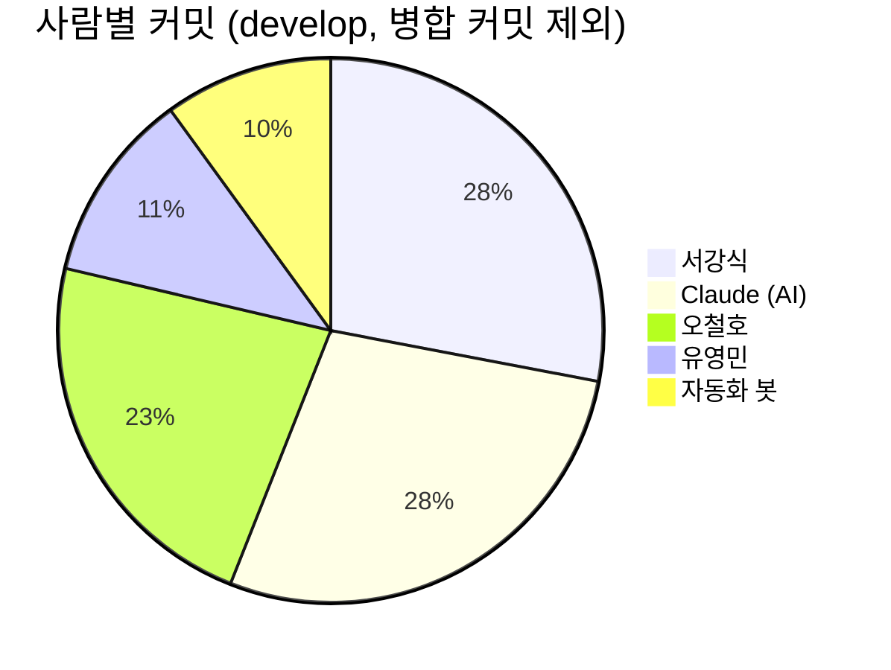
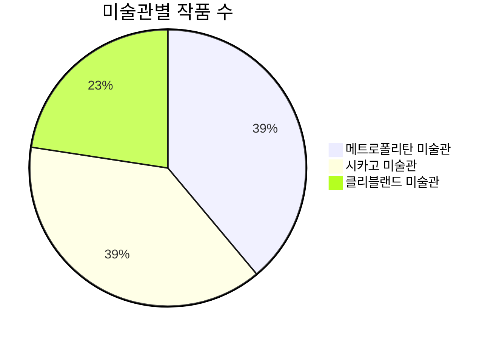
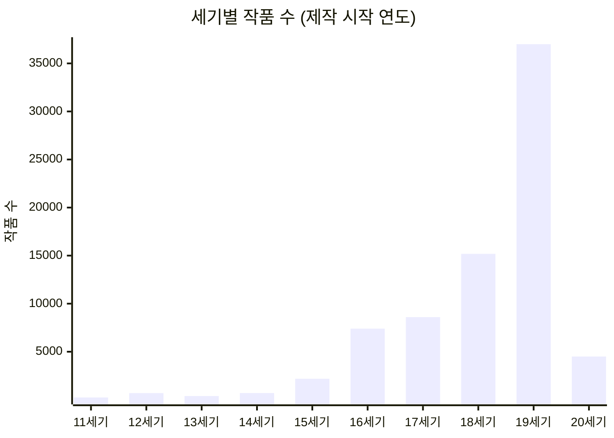

# 명화 챗봇 서비스 현황

2026-10-09 기준 스냅숏입니다. 원본 숫자는 [data/](data/) 폴더의 CSV에 있습니다.
(살아 있는 대화형 대시보드는 claude.ai Artifact로 따로 있습니다. 방문자·대화 수는 운영 DB에 있어 아직 포함되지 않았습니다.)

## 핵심 숫자

| 항목 | 값 |
|---|---:|
| 작품 수 | 78,624점 |
| 공개 저작물(CC0) 작품 | 78,624점 |
| 자동 테스트 | 409개 |
| API 주소 | 19개 |
| 앱 DB 표 | 9개 |
| GitHub 자동화 | 12개 |
| 응답 제한 시간 | 25초 |
| 실서비스 점검 주기 | 1분 |
| 합쳐진 PR | 83 / 89건 |
| 열린 이슈 | 28 / 89건 |

## 개발 활동

| 사람 | 합쳐진 PR | 닫힌 PR | 열린 PR |
|---|---:|---:|---:|
| 서강식 | 53 | 0 | 1 |
| 유영민 | 12 | 0 | 0 |
| 오철호 | 12 | 0 | 0 |
| 자동화 봇 | 6 | 5 | 0 |

## 운영과 자동 대응

| 자동화 | 성공 | 실패 | 기타 | 성공률 |
|---|---:|---:|---:|---:|
| autofix | 24 | 6 | 16 | 52% |
| codeql | 35 | 0 | 0 | 100% |
| deploy | 25 | 6 | 0 | 81% |
| archive-check | 1 | 16 | 0 | 6% |
| llm-eval | 8 | 0 | 0 | 100% |
| scorecard | 4 | 3 | 0 | 57% |
| collect-and-deploy | 4 | 1 | 0 | 80% |
| dependabot | 5 | 0 | 0 | 100% |
| monitor | 3 | 0 | 1 | 75% |
| autofix-ship | 1 | 0 | 2 | 33% |
| quality-review | 3 | 0 | 0 | 100% |
| security-intel | 2 | 0 | 0 | 100% |

| 이슈 종류 | 열림 | 닫힘 |
|---|---:|---:|
| 가디언 경보 | 16 | 43 |
| 기타 | 6 | 17 |
| 품질 점검 | 4 | 1 |
| 보안 | 2 | 0 |

### 지금 열린 이슈

| 번호 | 종류 | 제목 | 열린 날 |
|---:|---|---|---|
| #159 | 기타 | fix: 앱 설치 색·오프라인 화면이 새 디자인과 다르고 위키 함수명이 코드와 다름 | 2026-10-09 |
| #156 | 가디언 경보 | [가디언] 실시간 경보 — SERVER_ERROR — 긴급도 medium (2건) | 2026-10-09 |
| #155 | 가디언 경보 | [가디언] 실시간 경보 — SERVER_ERROR — 긴급도 medium (2건) | 2026-10-09 |
| #154 | 가디언 경보 | [가디언] 실시간 경보 — SERVER_ERROR — 긴급도 medium (1건) | 2026-10-08 |
| #153 | 가디언 경보 | [가디언] 실시간 경보 — SERVER_ERROR — 긴급도 medium (2건) | 2026-10-08 |
| #152 | 가디언 경보 | [가디언] 실시간 경보 — SERVER_ERROR — 긴급도 medium (1건) | 2026-10-08 |
| #151 | 가디언 경보 | [가디언] 실시간 경보 — SERVER_ERROR — 긴급도 medium (2건) | 2026-10-08 |
| #148 | 가디언 경보 | [가디언] 실시간 경보 — SERVER_ERROR — 긴급도 medium (2건) | 2026-10-08 |
| #147 | 가디언 경보 | [가디언] 실시간 경보 — SERVER_ERROR — 긴급도 medium (1건) | 2026-10-08 |
| #146 | 가디언 경보 | [가디언] 실시간 경보 — SERVER_ERROR — 긴급도 medium (1건) | 2026-10-08 |
| #145 | 보안 | [보안 동향] 배운 금지 문자열 | 2026-10-08 |
| #144 | 보안 | [보안 동향] 실시간 요약 | 2026-10-08 |
| #139 | 가디언 경보 | [가디언] 실시간 경보 — SERVER_ERROR — 긴급도 medium (2건) | 2026-10-08 |
| #137 | 가디언 경보 | [가디언] 실시간 경보 — SERVER_ERROR — 긴급도 medium (1건) | 2026-10-08 |
| #136 | 가디언 경보 | [가디언] 실시간 경보 — SERVER_ERROR — 긴급도 high (2건) | 2026-10-08 |
| #135 | 가디언 경보 | [가디언] 실시간 경보 — SERVER_ERROR — 긴급도 medium (2건) | 2026-10-08 |
| #134 | 가디언 경보 | [가디언] 실시간 경보 — SERVER_ERROR — 긴급도 medium (2건) | 2026-10-08 |
| #133 | 가디언 경보 | [가디언] 실시간 경보 — SERVER_ERROR — 긴급도 medium (1건) | 2026-10-08 |
| #127 | 품질 점검 | [품질] 건너뛰기 링크 없음 | 2026-10-08 |
| #126 | 품질 점검 | [품질] 정적 파일 캐시 헤더 미흡 | 2026-10-08 |
| #115 | 가디언 경보 | [가디언] 자동 수정 학습 기록 | 2026-10-08 |
| #114 | 품질 점검 | [품질] 본문 건너뛰기 링크 없음 | 2026-10-08 |
| #112 | 품질 점검 | [품질 점검] 체크리스트 보고서 | 2026-10-08 |
| #17 | 기타 | 배포·통합 점검 | 2026-09-29 |
| #16 | 기타 | ERD·API 문서 | 2026-09-29 |
| #10 | 기타 | 한국어 작가명·동의어 매핑 | 2026-09-29 |
| #9 | 기타 | 검색 관련도 필터 | 2026-09-29 |
| #8 | 기타 | MET 데이터 수집·적재 | 2026-09-29 |

## 작품 DB

| 작품 종류 (상위 10) | 작품 수 |
|---|---:|
| Print | 10,832 |
| etching | 7,182 |
| Drawings | 6,343 |
| woodblock print | 6,214 |
| Painting | 4,797 |
| lithograph | 3,440 |
| Drawing | 3,373 |
| Prints | 3,366 |
| Paintings | 3,145 |
| engraving | 2,622 |
