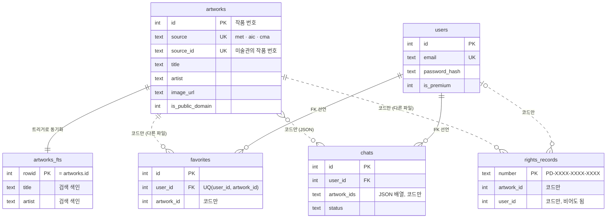

# 명화 챗봇 DB 키 지도 (PK·FK)

작품 DB(`data/art.db`)와 앱 DB(Turso)의 주키·외래키입니다. 인쇄용: [db-keys.pdf](db-keys.pdf)

- 실선: DB에 선언된 FK · 점선: 코드로만 지키는 연결(두 DB가 다른 파일이라 DB가 강제할 수 없음)

| DB | 표 | 주키 (PK) | 중복 금지 (UQ) | 외래키 (FK) |
|---|---|---|---|---|
| art.db | `artworks` | `id` | `(source, source_id)` | — |
| art.db | `artworks_fts` | `rowid (= artworks.id)` | — | 트리거로 artworks와 동기화 |
| 앱 DB | `users` | `id` | `email` | — |
| 앱 DB | `chats` | `id` | — | user_id → users.id (선언됨) · artwork_ids(JSON) → artworks.id (코드만) |
| 앱 DB | `favorites` | `id` | `(user_id, artwork_id)` | user_id → users.id (선언됨) · artwork_id → artworks.id (코드만) |
| 앱 DB | `rights_records` | `number (PD-XXXX-XXXX-XXXX)` | — | artwork_id → artworks.id (코드만) · user_id → users.id (코드만, 비어도 됨) |
| 앱 DB | `incidents` | `id` | — | — |
| 앱 DB | `access_log` | `id` | — | — |
| 앱 DB | `ai_usage` | `id` | — | — |
| 앱 DB | `runtime_flags` | `key` | — | — |
| 앱 DB | `rate_counters` | `bucket` | — | — |

## 알아둘 점
- `favorites.artwork_id`, `rights_records.artwork_id`, `chats.artwork_ids`는 작품 DB를 가리키지만 다른 파일이라 FK로 강제되지 않습니다. 즐겨찾기 API가 작품 존재를 먼저 확인합니다.
- `rights_records.user_id`는 FK 선언이 없습니다(비로그인 발급이면 비어 있음).
- 코드에 `PRAGMA foreign_keys = ON`이 없어 로컬 SQLite에서는 선언된 FK도 검사되지 않습니다.
